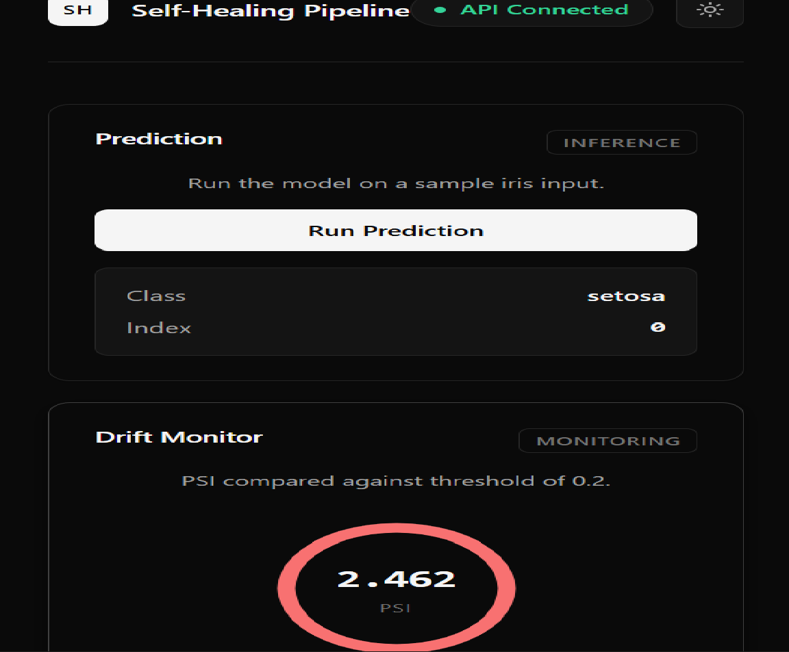
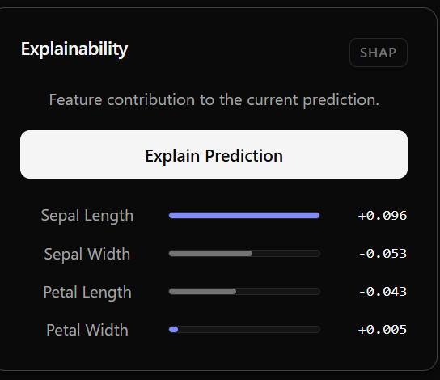
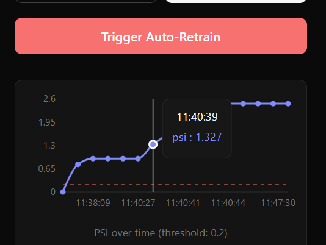
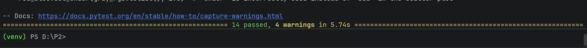

# Self-Healing ML Pipeline

A production-style ML pipeline that serves predictions, monitors data drift in real time, and automatically retrains when the incoming data distribution shifts.

Most ML projects stop at training a model. This one keeps watching after deployment.

---

## Live Demo

Try it right now — no setup required:

- **Dashboard** → https://self-healing-ml-pipeline.vercel.app
- **API** → https://self-healing-ml-pipeline.onrender.com
- **API Docs (Swagger)** → https://self-healing-ml-pipeline.onrender.com/docs

> Note: The backend runs on Render's free tier, so the first request after inactivity takes 30–60 seconds to wake up. Subsequent requests are fast.

---

## Screenshots

### Full Dashboard

*Live dashboard with predictions, PSI drift monitor, and SHAP explainability.*

### SHAP Explainability

*Every prediction comes with feature-level SHAP values.*

### Auto-Retrain Result

*When drift exceeds 0.2, the pipeline retrains and only promotes if F1 improves.*

### Tests Passing

*14 tests passing (10 API + 4 PSI-specific).*

---

## What It Does

1. **Serves predictions** — FastAPI endpoint that returns the predicted iris class
2. **Detects drift** — Computes PSI (Population Stability Index) on incoming data vs training data
3. **Explains predictions** — SHAP values for every individual prediction
4. **Auto-retrains** — When PSI crosses 0.2, retrains on combined data
5. **Promotes safely** — Only promotes the new model if its F1 score beats the current champion

---

## Results

### Model Performance

| Metric | Value |
|--------|-------|
| Baseline F1 (RandomForest) | 1.0000 |
| Post-retrain F1 | 0.9108 |
| Delta | -0.0892 |

The negative delta is intentional. When drift was detected, the pipeline retrained on the combined dataset, but the new model scored lower on the test set. The champion model stayed in production. That's the self-healing logic working correctly — never promote a worse model.

### API Latency (100 requests)

| Percentile | Latency |
|------------|---------|
| p50 (median) | 10.3 ms |
| p95 | 12.3 ms |
| p99 | 14.4 ms |
| mean | 10.6 ms |

### Drift Detection

| Metric | Value |
|--------|-------|
| PSI (no drift) | 0.0000 |
| PSI (after 20 extreme samples) | 1.3154 |
| Detection time | 5.4 ms |

**PSI interpretation:**
- PSI < 0.1 → No significant change
- 0.1 ≤ PSI < 0.2 → Moderate shift (monitor)
- PSI ≥ 0.2 → Significant shift (retrain triggered)

### Testing

```
14 tests passing (10 API + 4 PSI-specific)
```

Run them locally with:
```bash
pytest tests/ -v
```

---

## Architecture

```
┌─────────────────────────────────────────────────────────────┐
│                        USER                                  │
│                   Opens dashboard URL                        │
└───────────────────────────┬─────────────────────────────────┘
                            │ HTTPS
                            ▼
┌─────────────────────────────────────────────────────────────┐
│              VERCEL (Frontend)                               │
│  React · Vite · Recharts · Dark/Light theme                  │
│  https://self-healing-ml-pipeline.vercel.app                │
└───────────────────────────┬─────────────────────────────────┘
                            │ HTTPS + CORS
                            ▼
┌─────────────────────────────────────────────────────────────┐
│              RENDER (Backend)                                │
│  FastAPI · Uvicorn · Python 3.11                             │
│  https://self-healing-ml-pipeline.onrender.com              │
│                                                              │
│   /predict    /explain    /drift-report    /add-data         │
│                          │                                   │
│                    PSI > 0.2?                                │
│                          │                                   │
│                          ▼                                   │
│                    /auto-retrain                             │
│                          │                                   │
│                    New F1 > Old?                             │
│                     Yes │     │ No                           │
│                         ▼     ▼                              │
│                    Promote  Keep Old                         │
└────────────────────────────┬────────────────────────────────┘
                             │
                             ▼
┌─────────────────────────────────────────────────────────────┐
│                  MODEL LAYER                                 │
│  RandomForest · model.pkl · SHAP TreeExplainer              │
└─────────────────────────────────────────────────────────────┘
```

---

## Tech Stack

Python · FastAPI · scikit-learn · MLflow · SHAP · React · Docker · Render · Vercel

---

## API Endpoints

| Endpoint | Method | Purpose |
|----------|--------|---------|
| `/` | GET | API info + available endpoints |
| `/predict` | GET | Make a prediction |
| `/drift-report` | GET | Current PSI + drift status |
| `/explain` | GET | SHAP values for a prediction |
| `/add-data` | POST | Simulate incoming data |
| `/auto-retrain` | POST | Trigger retraining if drift detected |

---

## Run Locally

Make sure Docker Desktop is running. Then:

```bash
docker-compose up --build
```

Open in your browser:
- Dashboard → http://localhost:3000
- API → http://localhost:8000
- API Docs → http://localhost:8000/docs

---

## Design Decisions & Trade-offs

### Why RandomForest?
- Handles non-linear relationships better than Logistic Regression
- More robust to outliers than a single Decision Tree
- Works well without hyperparameter tuning — strong baseline performance
- Achieved F1 = 1.0000 on the iris test set

### Why PSI for Drift?
- **Interpretable** — values map to industry-standard thresholds (0.1, 0.2)
- **Sensitive to both mean and shape shifts** — catches what mean-difference misses
- **Cheap to compute** — 5.4 ms per call
- Alternatives like KL divergence are asymmetric and harder to explain; KS test only catches CDF shifts

### Why PSI threshold = 0.2?
- Industry standard for tabular data (credit scoring, fraud detection)
- 0.1 catches noise, 0.2 catches meaningful drift
- Balances false positives (unnecessary retraining) against false negatives (missing real drift)

### Why only promote if F1 improves?
- Prevents degrading the production model
- "Self-healing" should mean improving, not just changing
- Benchmark proved it: retrain F1 (0.9108) < baseline (1.0000) → old model kept

### What I'd change at scale
- **Real dataset** — Iris is a proof-of-concept. Production would use Telco Churn, credit fraud, or similar
- **Persistent storage** — Current `current_data` is in-memory. Production would use PostgreSQL or S3
- **Scheduled retraining** — Currently a manual API trigger. Production would use cron or Airflow
- **Model registry** — Currently uses `model.pkl`. Production would use MLflow Model Registry with Staging/Production aliases
- **Message queue** — Retraining runs synchronously. Production would use Celery or RabbitMQ
- **Data versioning** — No tracking of which data trained which model. Production would use DVC

---

## License

MIT